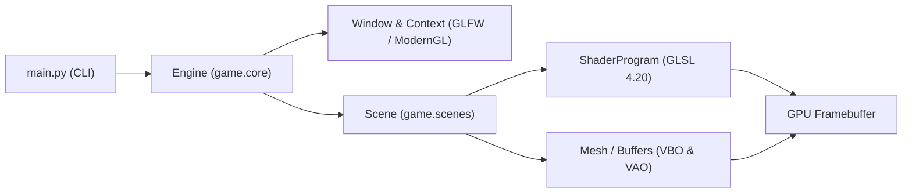

# 🎮 PyForm Graphics Engine

> Motor gráfico experimental e laboratório de computação gráfica procedural construído em Python moderno (3.12+), ModernGL (OpenGL 4.2 Core) e GLFW.

[](https://www.python.org/)
[](https://moderngl.readthedocs.io/)
[](https://www.opengl.org/)
[](TODO.md)
[](LICENSE)

O **PyForm** é uma bancada de experimentação prática e acadêmica dos conceitos de **Computação Gráfica Moderna**. Construído com foco em didática, baixa abstração e código limpo, o motor expõe diretamente os fundamentos do pipeline gráfico moderno (VBOs, VAOs, Shaders GLSL, UBOs, GPGPU e o loop de renderização da CPU/GPU), sem as camadas opacas de engines comerciais ou frameworks pesados.

---

## 🌟 Destaques & Filosofia Didática

- **Pipeline Gráfico Moderno:** Contexto estrito em OpenGL 4.2 Core Profile via ModernGL, dispensando pipelines legados de função fixa.
- **Construção Didática Passo a Passo:** Cada módulo, buffer e shader é construído incrementalmente para garantir aprendizado real — _o processo de compreensão é o objetivo primordial_.
- **Baixa Abstração & POO Limpa:** Buffers de vértice (`VBO`), arranjos de atributos (`VAO`), programas de shader e janelas são modelados com Programação Orientada a Objetos clássica e responsabilidade única.
- **Laboratório de Shaders & Proceduralismo:** Exploração do espectro completo de shaders (Vertex, Fragment/SDFs, Compute, Geometry e Tessellation) e compilação binária para SPIR-V.
- **Matemática Vetorizada & Áudio:** Suporte estruturado a NumPy e PyGLM para transformações afins (MVP), e `miniaudio` para reprodução sonora desacoplada.
- **Tooling Antifrágil Multi-OS:** Makefile POSIX compatível com Linux, FreeBSD e macOS, formatação rigorosa com Ruff e testes unitários automatizados.

---

## 🔬 Laboratório de Shaders & Computação Gráfica Moderna

O PyForm explora as tecnologias centrais dos pipelines gráficos modernos:

### 1. Espectro Completo de Shaders

| Tipo de Shader      | Extensão         | Papel Didático no PyForm                                                                                                                                                                                      |
| :------------------ | :--------------- | :------------------------------------------------------------------------------------------------------------------------------------------------------------------------------------------------------------ |
| **Vertex Shader**   | `.vert`          | Transformação de coordenadas do _object space_ para o _clip space_ (`gl_Position`) e projeções de câmera.                                                                                                     |
| **Fragment Shader** | `.frag`          | **Coração do 2D procedural:** renderização de formas analíticas via **SDF (Signed Distance Fields)** em tela cheia com antialiasing perfeito (`smoothstep`), pós-processamento (bloom, vinheta) e iluminação. |
| **Compute Shader**  | `.comp`          | **Paralelismo massivo GPGPU (`GL_ARB_compute_shader`):** simulação física de 100k+ partículas, autômatos celulares (_Game of Life_, _Falling Sand_) e fluidos em **SSBOs**, sem sobrecarregar a CPU.          |
| **Geometry Shader** | `.geom`          | Geração e expansão dinâmica de primitivas diretamente na GPU (ex: transformar pontos em _quads_ de partículas).                                                                                               |
| **Tessellation**    | `.tesc`, `.tese` | Subdivisão adaptativa de malhas geométricas (LOD) e avaliação analítica de curvas de Bézier/splines.                                                                                                          |

### 2. Uniform Buffer Objects (UBOs) & Padrão `std140`

Em vez de enviar variáveis uniformes de forma fragmentada para cada shader individual, o motor organiza estados globais (matrizes de câmera, tempo, resolução) em blocos de memória contígua compartilhados:

- **Alinhamento Binário Rigoroso:** Domínio prático das regras de empacotamento `std140` da GPU (alinhamento obrigatório de 16 bytes para vetores e matrizes).
- **Eficiência de Binding:** Múltiplos shaders acessam o mesmo bloco de dados através de um único ponto de amarração (`binding = 0`).

### 3. Ecossistema SPIR-V & Compilação Offline

Nos pipelines contemporâneos de produção (Vulkan, WebGPU, DirectX 12), os shaders são validados e compilados previamente para bytecode intermediário binário **SPIR-V (`.spv`)**:

- **Ferramentas Suportadas:** `glslangValidator` (Khronos), `glslc` (Google Shaderc), Slang (`slangc`) e DirectX Shader Compiler (`dxc`).
- **Benefícios:** Validação estática de erros de sintaxe antes do runtime e inicialização instantânea da aplicação.

---

## 🏛️ Arquitetura do Repositório

```text
PyForm/
├── game/
│   ├── assets/
│   │   └── shaders/      # Fontes GLSL (default.vert, default.frag)
│   ├── audio/            # Subsistema de áudio desacoplado com miniaudio
│   ├── core/             # Engine, Window, GLFW callbacks e sincronização
│   ├── graphics/         # ShaderProgram, Mesh (Triangle, Quad) e diagnósticos
│   └── scenes/           # Protocolo Scene e cenas de demonstração (SandboxScene)
├── tests/                # Testes unitários de pipeline e conformidade
├── Makefile              # Automação de compilação, testes e linting POSIX
├── pyproject.toml        # Metadados e dependências canônicas do projeto
└── main.py               # Entrypoint executável CLI com argumentos
```

### Fluxo de Execução & Renderização



---

## 💻 Pré-requisitos do Sistema

Bibliotecas de desenvolvimento OpenGL (`libGL.so` e `libEGL.so`) necessárias no sistema operacional:

### Fedora / RHEL

```bash
sudo dnf install -y libglvnd-devel mesa-libGL-devel mesa-libEGL-devel
```

### Debian / Ubuntu

```bash
sudo apt update && sudo apt install -y libgl-dev libegl-dev
```

### Arch Linux / Manjaro

```bash
sudo pacman -S --needed libglvnd mesa
```

### FreeBSD & Astral uv

No FreeBSD, a maioria dos pacotes Python com extensões em C/C++ (`moderngl`, `glcontext`, `pyglm`) não possuem _wheels_ binárias pré-compiladas no PyPI. A abordagem canônica e antifrágil consiste em utilizar os pacotes otimizados do sistema:

```sh
sudo pkg install -y libglvnd mesa-libs ruff py312-glfw py312-moderngl py312-numpy py312-pyglm py312-pillow
uv venv --system-site-packages .venv
```

---

## 🚀 Instalação e Execução

### Clonar e Instalar Dependências

```bash
git clone https://github.com/GabrielFrigo4/pyform
cd pyform
make install
```

### Comandos Disponíveis

| Comando       | Descrição                                                                 |
| :------------ | :------------------------------------------------------------------------ |
| `make run`    | Executa o motor na resolução padrão (960×540)                             |
| `make dev`    | Executa em resolução de desenvolvimento (1280×720)                        |
| `make test`   | Roda a suíte de testes unitários defensivos                               |
| `make lint`   | Executa análise estática de sintaxe e estilo com Ruff                     |
| `make format` | Formata automaticamente código Python (Ruff) e Markdown (Prettier)        |
| `make ci`     | Executa pipeline completo de quality gates locais                         |
| `make clean`  | Remove caches temporários (`__pycache__`, `.ruff_cache`, `.pytest_cache`) |

---

## 📄 Licença

Distribuído sob os termos da licença MIT. Consulte o arquivo [`LICENSE`](LICENSE) para mais detalhes.
