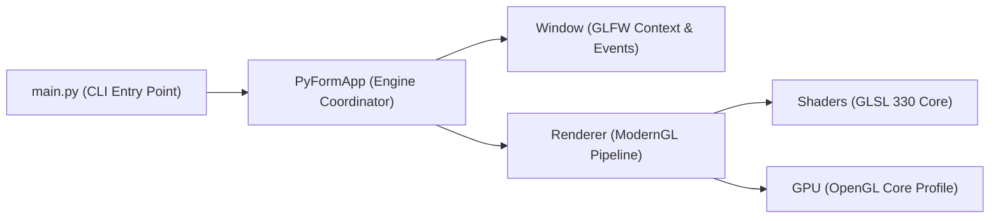

# PyForm

> Motor gráfico e ambiente de exploração procedural em Python moderno, ModernGL (OpenGL 3.3+ Core Profile) e GLFW.

[](https://www.python.org/)
[](https://moderngl.readthedocs.io/)
[](https://www.glfw.org/)
[](TODO.md)
[](LICENSE)
[](https://prettier.io/)

---

## Visao Geral

O **PyForm** é um ambiente para renderização em tempo real de formas geométricas analíticas, funções de distância assinada (SDF) e animações temporais contínuas em GPU. O projeto prioriza inicialização instantânea, arquitetura limpa sem bloat de frameworks pesados e código defensivo em Python 3.12+.



---

## Funcionalidades Principais

- **Pipeline ModernGL Puro:** Alocação direta de VBOs e VAOs com renderização em modo Core Profile sem dependências obsoletas de OpenGL imediato.
- **Janela e Contexto GLFW:** Gerenciamento nativo de janela, sincronização vertical (_v-sync_ a 60 FPS) e tratamento assíncrono de eventos e redimensionamento.
- **Shaders Procedurais:** Shaders GLSL com correção de aspecto de tela, cálculo analítico de distância e gradientes suaves de cor.
- **Gerenciamento Astral `uv`:** Inicialização e execução em frações de segundo com isolamento de ambiente virtual determinístico.

---

## Requisitos do Sistema

- **Python:** 3.12 ou superior
- **Astral `uv`:** (Recomendado) ou `pip` tradicional
- **GPU / Drivers:** Suporte a OpenGL 3.3 Core Profile ou superior

---

## Instalacao e Execucao

### 1. Clonagem e Configuracao dos Ganchos

```sh
git clone https://github.com/GabrielFrigo4/pyform.git
cd pyform
make hooks
```

### 2. Sincronizacao de Dependencias

```sh
make install
```

_(Ou diretamente via `uv sync`)_

### 3. Execucao

```sh
# Execução padrão (960x540)
make run

# Execução em alta resolução para desenvolvimento (1280x720)
make dev

# Execução customizada via CLI
python3 main.py --width 1920 --height 1080 --title "PyForm Full HD"
```

### Controles

- **ESC:** Encerra a aplicação de forma graciosa liberando os contextos de GPU.

---

## Comandos do Makefile

| Comando        | Descrição                                              |
| :------------- | :----------------------------------------------------- |
| `make run`     | Executa o motor gráfico com resolução padrão (960x540) |
| `make dev`     | Executa em resolução expandida (1280x720)              |
| `make install` | Sincroniza dependências via `uv` ou `pip`              |
| `make test`    | Executa a suíte de testes unitários defensivos         |
| `make lint`    | Analisa estilo e conformidade do código via Ruff       |
| `make format`  | Formata Markdown com Prettier e código com Ruff        |
| `make hooks`   | Configura os ganchos locais do Git (`.githooks/`)      |
| `make clean`   | Remove caches temporários (`__pycache__`, artefatos)   |
| `make ci`      | Valida quality gates locais para homologação           |

---

## Licenca

Distribuído sob os termos da licença [MIT](LICENSE). Copyright (c) 2026 Gabriel Frigo.
